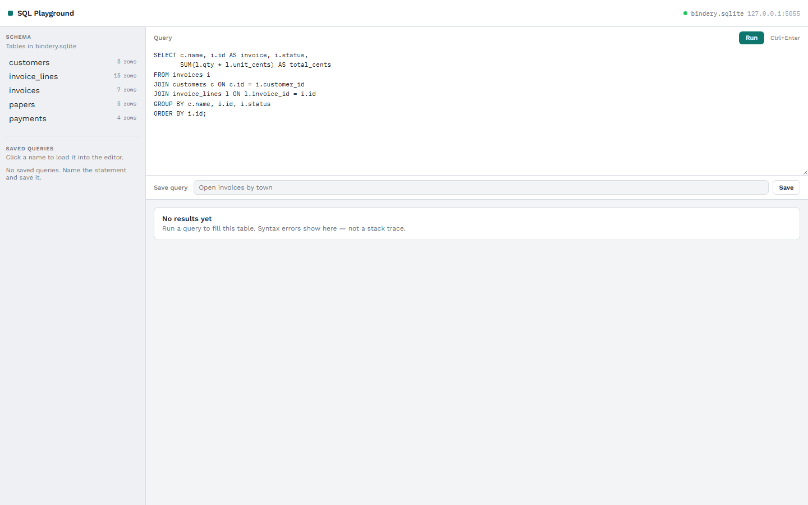

# SQL Playground

A local SQLite client: schema tree, SQL editor, results table. Work Sans for chrome; IBM Plex Mono for SQL and cells. Light gray shell with one teal accent — Harbor Bindery is still the seed (customers, paper stock, invoices, lines, payments), not the UI.

## Run it

From this folder, on Windows:

```powershell
python -m venv .venv
.\.venv\Scripts\Activate.ps1
pip install -r requirements.txt
python -m sql_playground
```

Open [http://127.0.0.1:5055](http://127.0.0.1:5055). You should see the schema on the left, a starter `SELECT` in the editor, and an empty results pane.

- **Run** (or Ctrl+Enter) fills the results grid.
- Bad SQL shows as a query error, not a stack trace.
- **Save** stores the current statement in `data/saved.sqlite`. Click a saved query to load it back.
- First launch creates `data/bindery.sqlite` from the seed. Delete that file and restart for a clean database.

## Layout

- `sql_playground/domain` — query results, saved queries, schema types
- `sql_playground/data` — SQLite, inspect, execute, seed
- `sql_playground/ui` — Flask + Jinja + HTMX desk

## Screenshot


